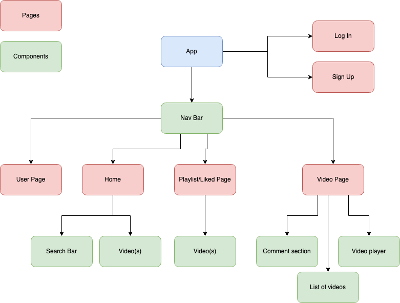
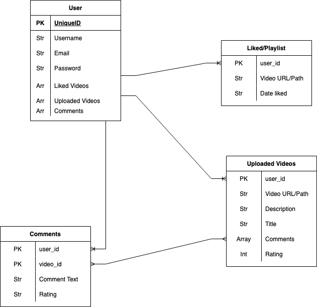
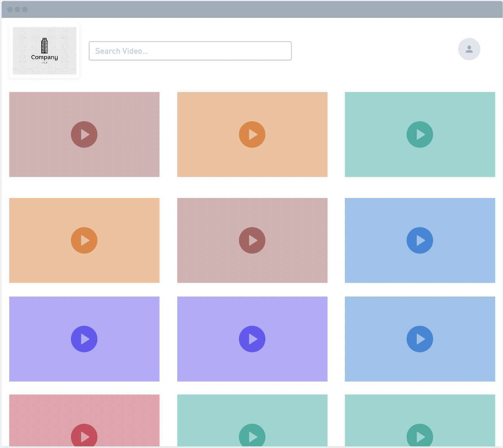
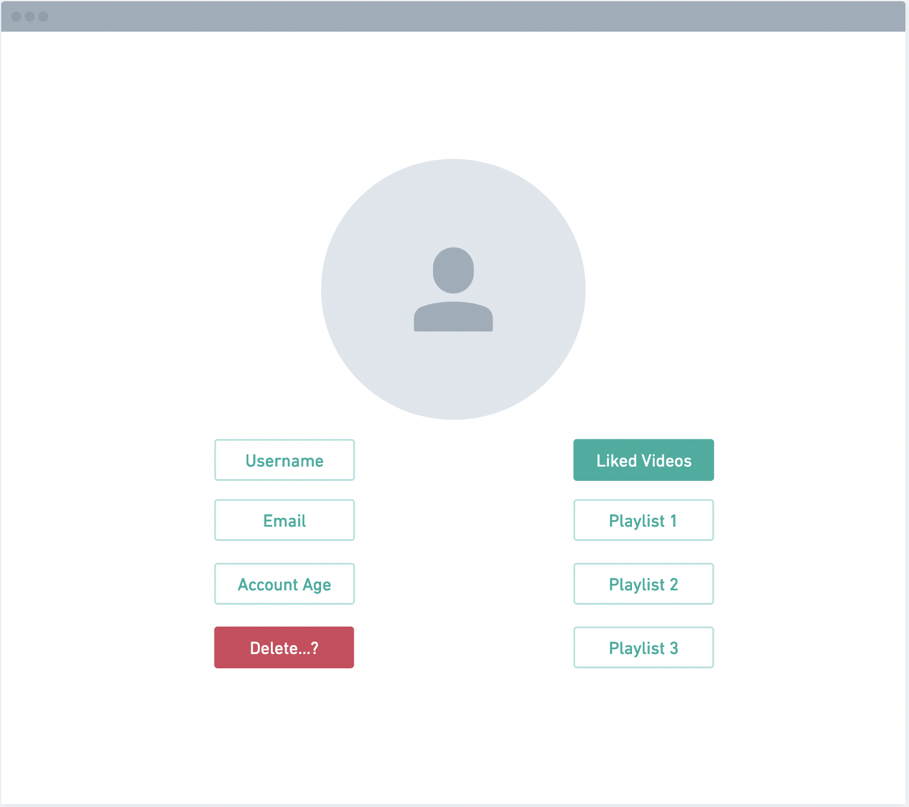
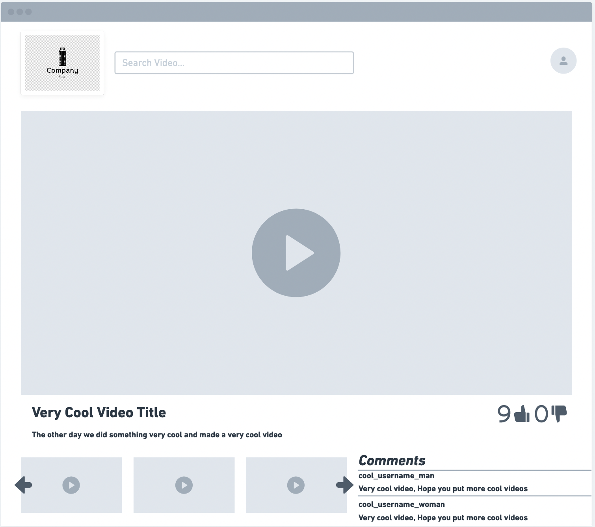

# VDO

### By Pablo Yocupicio

[LinkedIn](https://www.linkedin.com/in/pabloey/) | [Website]() | [GitHub](https://github.com/Pabloey)

### VDO is a social platform where you can share your favorite videos, like videos, rate videos, make playlists, and add comments!

---

### Technologies Used

#### Back-End

- Django
- Python
- PostgreSQL

#### Front-End

- React.js
- CSS

---

### Planning

[Trello](https://trello.com/b/zCzbkxmt/project-4-video-website)

#### Component Hierarchy Diagram

#### Entity Relationship Diagram

#### Example Pictures

### Inspiration

Full inspiration for website comes from YouTube.
